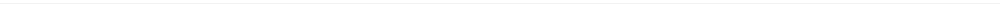

# Userscript Graveyard ⚰️

はかば。

## ⚠️ Attention

ここにあるのはリポジトリを建てるほどやる気があるわけでもないスクリプト達です。

書いた当時は動いたけれど、現在では動いていない可能性もあります。むしろ書いた当時ですら動いていなかったかもしれません。

やる気が無いのですから、おそらく設定画面はありませんし、エラーは握りつぶされデバッグしづらく、必要のない DOM の変更をしてパフォーマンスに影響を与えているかもしれません。

これらのスクリプトが満足に動くと期待しないでください。問題があれば issue を建ててもらえれば目は通しますが、対応はしないと思います。（ちょろいのでおだてればできる範囲は対応するでしょう）

スクリプトはすべて MIT ライセンスのため、fork、公開するのは自由です。

PR はおそらく受け入れます。

## 🎨 userstyle

[Stylus](https://chrome.google.com/webstore/detail/stylus/clngdbkpkpeebahjckkjfobafhncgmne?hl=ja)で動作確認済み。

リポジトリになってるのは[user:eai04191 topic:userstyle](https://github.com/search?q=user%3Aeai04191+topic%3Auserstyle)で確認して。

### [twitter.javaStyleButton.user.styl](/userstyle/twitter.javaStyleButton.user.styl)

Twitter のボタン（フォローとか）を[ジャバ](https://www.java.com/ja/download/)っぽくする。

### [mastodon.omoshiika.user.styl](/userstyle/mastodon.omoshiika.user.styl)

連合タイムラインにアイコンだけ表示するようにする。

> SNS はアイコンが 10 割なので連合タイムラインはアイコンだけ表示するようにしたら重しイカもしれない
> https://mstdn.maud.io/users/Eai/statuses/100610017821558791

### [mastodon.gaminghota.user.styl](/userstyle/mastodon.gaminghota.user.styl)

https://mstdn.maud.io/users/Eai/statuses/101142623916415083

### [youtube.capture.user.styl](/userstyle/youtube.capture.user.styl)

YouTube でシアターモードで再生中の動画の大きさを 1920x1080 にして、上に乗っかってるボタンなどを消す。

ボタンや影など邪魔されずに等倍の大きさで`video`ノードのスクリーンショットを撮影できる。

1920x1080 で取るためにはそれより大きいディスプレイが必要。画像は 2560x1440。

### [tissue.safemode.user.styl](/userstyle/tissue.safemode.user.styl)

[Tissue](https://shikorism.net/) のセンシティブな要素を隠すスタイル。

センシティブな要素しかないだろ。

### [nijie.fluid.user.styl](/userstyle/nijie.fluid.user.styl)

ニジエの作品ページで枠を 100%にして絵を大きく表示するスタイル。

めんどくさくてすべての要素の `box-sizing` をいじったので若干崩れる箇所がある。

### [notestock.searchcount.user.styl](/userstyle/notestock.searchcount.user.styl)

notestock の検索結果に見つかった件数を表示するスタイル。

### [github.expandItems.user.styl](/userstyle/github.expandItems.user.styl)

GitHub のタイムラインでたたまれる項目を常に展開するスタイル。

### [mastodon.privacyfilter.user.styl](/userstyle/mastodon.privacyfilter.user.styl)

Mastodon の WebUI から個人を特定できそうなのを隠すスタイル。

### [google.selectableLyrics.user.styl](/userstyle/google.selectableLyrics.user.styl)

Google の検索結果に出てくる歌詞を選択可能にする。

### [steamcommunity.bigCollectionPreview.user.styl](/userstyle/steamcommunity.bigCollectionPreview.user.styl)

Steam のコレクションの画像を拡大する

### 

## 🛠️ userscript

[Violentmonkey](https://violentmonkey.github.io/) で動作確認済み。

リポジトリになってるのは[user:eai04191 topic:userscript](https://github.com/search?q=user%3Aeai04191+topic%3Auserscript)で確認して。

### [mastodon.donsogigi.user.js](/userscript/mastodon.donsogigi.user.js)

`#そぎぎ`を追加するボタンを追加する。@mohemohe が直してくれた。

[:don:そぎ by mohemohe · Pull Request #1 · eai04191/userscript-graveyard](https://github.com/eai04191/userscript-graveyard/pull/1)

### [notestock.loginCodeButton.user.js](/userscript/notestock.loginCodeButton.user.js)

**[Deprecated]**

認証画面にトゥートするボタンを追加する。

現在は公式にトゥート、note するボタンが追加された。

続編: [notestock.AutoLogin.user.js](#notestockautoLoginuserjs)

### [pixiv.openWithMangaView.user.js](/userscript/pixiv.openWithMangaView.user.js)

**[Deprecated]**

pixiv のユーザーのイラスト一覧の画面で、イラストの漫画ビューを直接開くボタンを追加する。

現在はイラストページから漫画が見れるので必要なくなった。

### [github.relativeTime.user.js](/userscript/github.relativeTime.user.js)

GitHub の時間表記`on 30 Jul 2018`などを`2018/7/30 22:41`といった表記に変更する。

### [picrew.mastodonIntegration.user.js](/userscript/picrew.mastodonIntegration.user.js)

picrew の完成画面で直接投稿できるボタンを追加する。

使うには 15,16 行目のホストとトークンを書き換える。

### [tissue.tagMute.user.js](/userscript/tissue.tagMute.user.js)

[Tissue](https://shikorism.net/) にタグミュートのようなものを追加するやつ。

使うときは 14 行目の配列を書き換える

使ってるとタグミュートしていることを忘れるので注意。

### [mastodon.bigben.user.js](/userscript/mastodon.bigben.user.js)

https://mastodon.org.uk/@bigben の BONG がホームに流れたらぼんぐぼんぐしてくれる。

https://stellaria.network/users/Eai/statuses/102006336379176131

飽きる。

### [mastodon.xfiles.user.js](/userscript/mastodon.xfiles.user.js)

`x-files`あたりの文字がホームに流れたら X-files のテーマが流れる。

https://stellaria.network/users/Eai/statuses/101998013693873129

### [mastodon.ussr.user.js](/userscript/mastodon.ussr.user.js)

☭ やがホームに流れたらソビエト連邦の国歌が流れる。

https://stellaria.network/users/Eai/statuses/102163905594645230

### [mastodon.nbsp.user.js](/userscript/mastodon.nbsp.user.js)

半角スペースを ZWNBSP に変換するボタンを追加する。

[CodePen で前作った](https://codepen.io/eai/full/mGVOLj)けどやはり投稿画面にあったほうが便利なので。

### [mouneyou.mastodon.user.js](/userscript/mouneyou.mastodon.user.js)

[てゆうかもう寝よう。](http://mouneyou.rgx6.com/)から Mastodon に投稿するボタンを追加する。

#### 設定項目

`GM_getValue`でホスト名とトークンを取得するので設定しておく。

| キー  | 値                                                                                |
| ----- | --------------------------------------------------------------------------------- |
| host  | お使いの Mastodon サーバーのホスト名                                              |
| token | Mastodon の設定から**開発**->**新規アプリ**で作成して、できた**アクセストークン** |

Violentmonkey ならインストールした後ダッシュボードから**編集**->**値**

Tampermonkey はわからん（ないっぽい）（つまり使えないということです）

### [twitter.downloadOriginalImage.user.js](/userscript/twitter.downloadOriginalImage.user.js)

新しい Twitter の UI 用に書いた原寸画像ダウンローダー

画像の詳細かツイートの詳細を開いた状態で D キーを押すと、その時表示している画像の原寸画像を全てダウンロードする。

### [tissue.editButton.user.js](/userscript/tissue.editButton.user.js)

Tissue のお惣菜コーナーで自分のチェックインに編集ボタンを追加する。

### [twitter.betterArrow.user.js](/userscript/twitter.betterArrow.user.js)

Twitter で画像を見ている時に矢印上と矢印下でページ送りができるようになる。

さらにスレッドが続いていて、4 枚目の画像を見ている時に矢印下で送ると、次のツイートの 1 番目の画像を開けるようになる。

同様に前にスレッドがある時、1 枚目の画像をを見ているときに矢印上で送ると、前のツイートの 4 番目の画像に戻ることができる。

### [notestock.AutoLogin.user.js](/userscript/notestock.AutoLogin.user.js)

notestock で自動でログインしてくれるやつ

使う前にトークンとか設定すること。

設定の例: 

### [steamcommunity.rimWorld.moddb.info.user.js](/userscript/steamcommunity.rimWorld.moddb.info.user.js)

Steam ワークショップで RimWorld のアイテムを開いたとき、[RimWorld Mod データベース](https://rimworld.2game.info/)に説明や日本語化ファイルがあるか表示するやつ。

### 

## 🔖 bookmarklet

### [mastodon.embed.js](/bookmarklet/mastodon.embed.js)

Mastodon のトゥートページで実行すると埋め込みコードを得ることができる。

### 

## ❓ その他

### [violentmonkey.oneline.css](/userstyle/violentmonkey.oneline.css)

Violentmonkey の設定画面で 1 スクリプト 1 行で表示する CSS。

Violentmonkey の 設定 -> 高度な設定 -> カスタムスタイル に貼り付けて使用する。

## Contributors

Thanks goes to these wonderful people ([emoji key](https://allcontributors.org/docs/en/emoji-key)):

<!-- ALL-CONTRIBUTORS-LIST:START - Do not remove or modify this section -->
<!-- prettier-ignore -->
<table><tr><td align="center"><a href="https://mizle.net"> <b>Aoi Irie</b></a> <a href="https://github.com/eai04191/userscript-graveyard/commits?author=eai04191" title="Code">💻</a> <a href="https://github.com/eai04191/userscript-graveyard/commits?author=eai04191" title="Documentation">📖</a></td><td align="center"><a href="https://github.com/mohemohe"> <b>mohemohe</b></a> <a href="https://github.com/eai04191/userscript-graveyard/commits?author=mohemohe" title="Code">💻</a></td></tr></table>

<!-- ALL-CONTRIBUTORS-LIST:END -->

This project follows the [all-contributors](https://github.com/all-contributors/all-contributors) specification. Contributions of any kind welcome!
